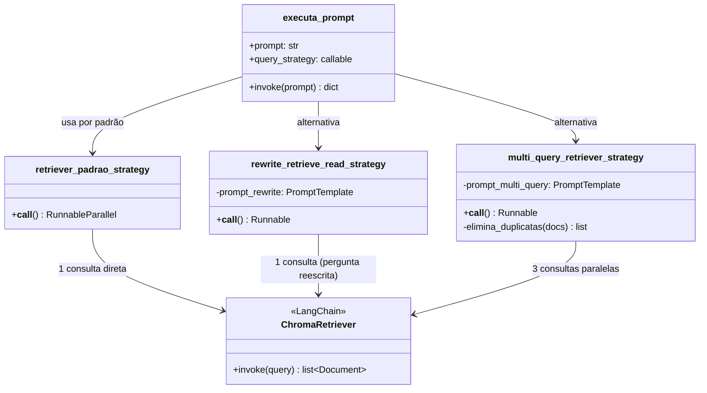

# Evolução do Projeto: RAG Jurídico

**Guia para Analistas com experiência em Python 3.13+**

---

## Índice

1. [Visão Geral do Projeto](#1-visão-geral-do-projeto)
2. [Branch `main` — Versão Base (Sprint 1 — Prática)](#2-branch-main--versão-base-sprint-1--prática)
3. [Branch `resposta-sprint1` — Idêntica à `main`](#3-branch-resposta-sprint1--idêntica-à-main)
4. [Branch `resposta-sprint1-com-runnables` — Modernização da API](#4-branch-resposta-sprint1-com-runnables--modernização-da-api)
5. [Branch `resposta-sprint2` — Observabilidade e Estratégias Avançadas](#5-branch-resposta-sprint2--observabilidade-e-estratégias-avançadas)
6. [Resumo Executivo](#6-resumo-executivo)

---

## 1. Visão Geral do Projeto

Este projeto simples de propósito didático que implementa um **assistente jurídico** baseado na técnica **RAG**
(_Retrieval-Augmented Generation_). O sistema responde perguntas sobre o **Código de Defesa do Consumidor (CDC)**
e a **Lei Geral de Proteção de Dados (LGPD)** usando:

- **LangChain** — framework de orquestração de LLMs (Large Language Models)
- **OpenAI** — modelo de linguagem (`gpt-*`) e embeddings (`text-embedding-3-small`)
- **ChromaDB** — banco de dados vetorial local para armazenar os documentos indexados

### O que é RAG?

Veja um diagrama simplificado de como funciona o RAG

```
Pergunta do usuário
       │
       ▼
┌─────────────────┐     ┌──────────────────────────────┐
│  Base Vetorial  │────▶│  Documentos mais relevantes  │
│  (ChromaDB)     │     │  (CDC / LGPD)                │
└─────────────────┘     └──────────────┬───────────────┘
                                       │
                                       ▼
                          ┌────────────────────────┐
                          │  LLM (OpenAI GPT)      │
                          │  Pergunta + Contexto   │
                          └────────────┬───────────┘
                                       │
                                       ▼
                               Resposta Final
```

<!-- TODO: template para novos TODOs. Claude, não remova -->

A ideia central do RAG é: **em vez de depender apenas da memória do LLM**, buscamos **trechos relevantes**
dos documentos jurídicos e os fornecemos como contexto ao modelo antes de gerar a resposta.

### Por que usar RAG em vez de mandar tudo para o LLM de uma vez?

Imagine que você quer que o assistente responda perguntas sobre o CDC — um documento com mais de 100 páginas. Você poderia simplesmente enviar o texto completo junto com cada pergunta. O problema: os LLMs têm um **limite de contexto** (a quantidade de texto que conseguem processar de uma vez), e enviar documentos inteiros é caro em tokens e lento. Mais importante, **quanto mais texto irrelevante o modelo recebe, maior a chance de ele se confundir ou inventar informações** — o fenômeno conhecido como _alucinação_.

O RAG resolve isso de forma elegante:

1. **Redução do contexto:** em vez de enviar o documento inteiro, o sistema recupera apenas os **5 a 10 trechos (chunks) mais relevantes** para aquela pergunta específica. O LLM recebe um contexto pequeno, preciso e focado.

2. **Restrição do escopo de conhecimento:** ao limitar o contexto ao conteúdo do CDC ou da LGPD, o modelo é forçado a basear sua resposta naqueles documentos. Isso evita que ele "invente" informações a partir do seu treinamento geral — especialmente importante em domínios técnicos como o jurídico, onde precisão é crítica.

3. **Menos alucinação, mais acurácia:** quando o LLM recebe um contexto confiável e restrito, as respostas tendem a ser mais fiéis ao documento-fonte. É como dar ao modelo uma "cola autorizada" em vez de deixá-lo responder de memória.

### O papel da pesquisa semântica

A busca dos trechos relevantes não é feita por palavras-chave, mas por **similaridade semântica** — e essa distinção é fundamental.

Busca por palavra-chave encontra documentos que contêm exatamente os termos digitados. Busca semântica encontra documentos com o **mesmo significado**, mesmo usando palavras diferentes.

**Exemplo:** a pergunta _"Posso pedir cancelamento do serviço?"_ não contém a palavra "rescisão", mas um sistema de busca semântica consegue encontrar o artigo do CDC que trata de "rescisão contratual" porque entende que os dois conceitos são relacionados.

Isso é possível porque os textos são convertidos em **embeddings** — vetores numéricos que representam o significado do texto em um espaço matemático multidimensional. Textos semanticamente similares ficam próximos nesse espaço, e o banco vetorial (ChromaDB, por exemplo) encontra os mais próximos da pergunta do usuário com eficiência.

---

## 2. Branch `main` — Versão Base (Sprint 1 — Prática)

> **Referência no Trello:** https://trello.com/b/hLEcKGPE/agentes-para-devs-sprint-1

Esta é a versão mais simples e educacional do projeto. É a "resposta prática" da Sprint 1.

### 2.1 Estrutura de Arquivos

```
rag-juridico/
├── app.py          ← Interface de linha de comando (chat loop)
├── bd.py           ← Gestão do banco vetorial (ChromaDB)
├── rag.py          ← Lógica de RAG e reranking
├── dados/
│   ├── cdc.pdf     ← Texto completo do CDC
│   └── lgpd.pdf    ← Texto completo da LGPD
└── .env            ← Configurações (chaves de API, caminhos). Este arquivo não é persistido no repositório remoto por questões de segurança.
```

### 2.2 Arquivo `bd.py` — Banco de Dados Vetorial

Este arquivo é responsável por **transformar os PDFs em vetores** e armazená-los no ChromaDB.

```python
# Configuração via variáveis de ambiente
config = dotenv.dotenv_values()
db_dir = Path(config['CHROMA_DB_PATH'])
embedding = OpenAIEmbeddings(model=config['EMBEDDINGS_MODEL'], openai_api_key=config['OPENAI_KEY'])
```

**Fluxo de indexação:**

```
PDF (cdc.pdf / lgpd.pdf)
        │
        ▼ PyPDFLoader
list[Document]  ← cada página = 1 documento
        │
        ▼ configura_metadado()
Adiciona metadata: {'fonte': 'cdc'} ou {'fonte': 'lgpd'}
        │
        ▼ RecursiveCharacterTextSplitter(chunk_size=1000, chunk_overlap=200)
Chunks menores (pedaços de ~1000 caracteres com 200 de sobreposição)
        │
        ▼ OpenAIEmbeddings
Vetores numéricos (representação semântica do texto)
        │
        ▼ Chroma.from_documents()
Armazenado em disco (chroma_db/)
```

**Ponto de atenção:** `chunk_overlap=200` garante que frases cortadas entre dois chunks ainda apareçam em ambos, evitando perda de contexto. Este é um mecanismo simplificado para recortar os textos em fatias com `overlap` para não perder a semântica entre chunks.

**Função principal:**

```python
def carrega_banco_vetorial() -> Chroma:
    if db_dir.exists():
        # Se o banco já existe em disco, apenas carrega (não reindexar!)
        return Chroma(embedding_function=embedding, persist_directory=str(db_dir), ...)

    # Caso contrário, cria do zero
    documentos = carrega_documentos()
    chunks = cria_chunks(documentos)
    todos_os_chunks = chunks['cdc'] + chunks['lgpd']
    return Chroma.from_documents(todos_os_chunks, embedding, ...)
```

### 2.3 Arquivo `rag.py` — Lógica Principal

#### Configuração (nível de módulo)

```python
banco_vetorial = bd.carrega_banco_vetorial()
retriever = banco_vetorial.as_retriever(search_type='similarity', search_kwargs={'k': 5})

llm = ChatOpenAI(model=config['LLM_MODEL'], openai_api_key=config['OPENAI_KEY'])

# API legada do LangChain (langchain_classic) será substituída nas próximas branches do projeto.
llm_com_rag = RetrievalQA.from_chain_type(
    llm=llm,
    retriever=retriever,
    return_source_documents=True,
    chain_type='stuff'    # 'stuff' = concatena todos os docs no contexto
)
```

> **Nota:** `langchain_classic` é a biblioteca de compatibilidade com a API legada do LangChain. O `RetrievalQA` é uma abstração de alto nível que faz o RAG "por debaixo dos panos".

#### Método 1 — `executa_prompt()` — RAG Simples

```python
def executa_prompt(prompt: str) -> dict[str, Any]:
    # Monta o prompt com instrução de sistema
    prompt_final = f'''
Você é um assistente jurídico...
Pergunta: {prompt}
'''
    # Invoca o chain de RAG legado
    completion = llm_com_rag.invoke({"query": prompt_final})

    # Extrai resultado e fontes
    resposta = {'resultado': completion['result'], 'fontes': []}
    if resposta['resultado'].strip() != 'Desculpe, só posso responder...':
        resposta['fontes'] = [extrai_fonte(doc) for doc in completion['source_documents']]

    return resposta
```

**Fluxo:** `prompt` → `RetrievalQA` → busca 5 docs → LLM com contexto → resposta

#### Método 2 — `executa_prompt_reranking()` — RAG com Reranking Manual

O `reranking` é um dos processos que melhora a qualidade dos documentos recuperados antes de enviá-los ao LLM final.

```python
def rankeia_documentos(prompt_original):
    # Passo 1: Recupera 15 candidatos do banco vetorial (mais amplo que o normal)
    documentos_iniciais = banco_vetorial.similarity_search(prompt_original, k=15)

    rankeados = []
    for doc in documentos_iniciais:
        # Passo 2: Para CADA documento, pergunta ao LLM: "quão relevante é este trecho?"
        # PROBLEMA: faz N chamadas sequenciais à API (lento e caro!)
        resposta = llm.invoke(
            prompt_de_rankeamento.format(pergunta=prompt_original, trecho=doc.page_content)
        ).content.strip()

        score = float(resposta)  # nota de 0 a 10
        rankeados.append((doc, score))

    # Passo 3: Ordena do mais para o menos relevante
    rankeados.sort(key=lambda x: x[1], reverse=True)
    return [doc for doc, score in rankeados]


def executa_prompt_reranking(prompt: str) -> dict[str, Any]:
    documentos_rankeados = rankeia_documentos(prompt)
    top_4_documentos = documentos_rankeados[:4]  # Usa apenas os 4 melhores

    # Monta contexto manual (não usa o chain llm_com_rag)
    contexto_consolidado = "\n\n".join([doc.page_content for doc in top_4_documentos])
    completion = llm.invoke(prompt_final)  # LLM direto, sem retriever

    return {'resultado': completion.content, 'fontes': [...]}
```

**Problema desta versão:** o `for doc in documentos_iniciais` faz **15 chamadas sequenciais** à API do OpenAI — uma de cada vez. Isso é lento.

#### `app.py` — Interface de Usuário

```python
def inicia_chat():
    print('### BEM-VINDO AO ASSISTENTE JURÍDICO! ###')
    prompt = efetua_pergunta()

    while prompt.strip().lower() != 'sair':
        # Na branch main, usa o reranking (comentário indica que executa_prompt existe)
        resposta = rag.executa_prompt_reranking(prompt)

        print(f'\n# RESPOSTA\n{resposta["resultado"]}\n')
        if resposta['fontes']:
            imprime_fontes(resposta)

        prompt = efetua_pergunta()
```

### 2.4 Variáveis de Ambiente (`.env`)

```ini
OPENAI_KEY = sua_chave_aqui
CDC_PATH = dados/cdc.pdf
LGPD_PATH = dados/lgpd.pdf
CHROMA_DB_PATH = dados/chroma_db
EMBEDDINGS_MODEL = text-embedding-3-small
LLM_MODEL = gpt-5-mini
```

### 2.5 Resumo da Branch `main`

| Aspecto                      | Detalhe                                  |
| ---------------------------- | ---------------------------------------- |
| API do LangChain             | Legada (`langchain_classic.RetrievalQA`) |
| Chamadas ao LLM no reranking | **Sequenciais** (loop `for`)             |
| Prompt                       | String f-string simples                  |
| Observabilidade              | Nenhuma                                  |
| Avaliação automatizada       | Nenhuma                                  |
| Estratégias de busca         | Somente similaridade direta              |

---

## 3. Branch `resposta-sprint1` — Idêntica à `main`

A branch `resposta-sprint1` é **exatamente igual** à `main` em termos de código.

```bash
git diff main..resposta-sprint1
# (sem saída — zero diferenças)
```

Ela representa o **ponto de partida da Sprint 1**: o enunciado do exercício já continha a solução funcional para demonstração, e essa branch preserva esse estado antes das evoluções técnicas. O próximo passo é a modernização para a nova API do LangChain.

---

## 4. Branch `resposta-sprint1-com-runnables` — Modernização da API

Esta branch refatora o projeto para usar a **LangChain Expression Language (LCEL)**, a API moderna do LangChain baseada em **Runnables**.

### 4.1 O que são Runnables?

Runnables são objetos do LangChain que implementam uma interface comum com `.invoke()`, `.batch()` e `.stream()`. Eles podem ser **compostos com o operador `|`** (pipe), formando pipelines legíveis e funcionais, semelhante ao pipe do Unix.

```python
# Mudanças nas APIs do LangChain
# Antes (API legada):
llm_com_rag = RetrievalQA.from_chain_type(llm=llm, retriever=retriever, ...)
resultado = llm_com_rag.invoke({"query": prompt})

# Depois (LCEL):
chain = pesquisa_documentos | monta_contexto | executa_llm | monta_resposta
resultado = chain.invoke(prompt)
```

### 4.2 Mudanças em `rag.py`

#### Imports alterados

```python
# Removido:
from langchain_classic.chains import RetrievalQA  # API legada

# Adicionados:
from langchain_core.prompts import PromptTemplate, ChatPromptTemplate
from langchain_core.output_parsers import StrOutputParser
from langchain_core.runnables import RunnablePassthrough, RunnableLambda, RunnableParallel
```

#### Prompt como `ChatPromptTemplate` (mensagens estruturadas)

```python
# Antes: f-string concatenando tudo numa string única
prompt_final = f'''
Você é um assistente jurídico...
Pergunta: {prompt}
'''

# Depois: template estruturado com papel system/human
rag_prompt = ChatPromptTemplate.from_messages([
    (
        "system",
        "Você é um assistente jurídico especializado em..."
    ),
    (
        "human",
        "Pergunta:\n{pergunta}\nContexto:\n{contexto}"
    )
])
```

A separação entre `system` e `human` é uma prática melhor, pois respeita a estrutura nativa da API de chat da OpenAI.

#### Pipeline de RAG com `|` (pipe)

```python
# Cada "etapa" é um Runnable que transforma o payload
pesquisa_documentos = RunnableParallel(
    pergunta=RunnablePassthrough(),   # passa a string original
    documentos=retriever              # consulta o banco vetorial em paralelo
)
# Resultado: {'pergunta': 'Qual é...?', 'documentos': [doc1, doc2, ...]}

monta_contexto = RunnablePassthrough.assign(
    contexto=lambda payload: gera_contexto_de_documentos(payload['documentos'])
)
# Resultado: {..., 'contexto': 'texto concatenado dos documentos'}

executa_prompt = RunnablePassthrough.assign(
    resposta=RunnablePassthrough() | rag_prompt | llm | StrOutputParser()
)
# Resultado: {..., 'resposta': 'texto da resposta do LLM'}

monta_resposta = RunnableLambda(
    lambda payload: monta_resposta_com_fontes(payload['resposta'], payload['documentos'])
)
# Resultado: {'resultado': '...', 'fontes': [...]}

# Composição final com o operador pipe
llm_com_rag = (
    pesquisa_documentos
    | monta_contexto
    | executa_prompt
    | monta_resposta
)
```

A função `executa_prompt()` vira simplesmente:

```python
def executa_prompt(prompt: str) -> dict[str, Any]:
    return llm_com_rag.invoke(prompt)
```

#### Reranking com `llm.batch()` — Chamadas Paralelas

A melhoria mais importante de **performance** desta branch:

```python
# Antes: loop sequencial (15 chamadas uma por vez)
for doc in documentos_iniciais:
    resposta = llm.invoke(prompt_de_rankeamento.format(...)).content.strip()
    rankeados.append((doc, float(resposta)))

# Depois: batch paralelo (todas as 15 chamadas de uma vez)
msgs_rankeamento = [
    prompt_de_rankeamento.format(pergunta=prompt_original, trecho=doc.page_content)
    for doc in documentos_iniciais
]
respostas = llm.batch(msgs_rankeamento)  # ← chamada paralela!
rankeados = [
    (doc, float(resposta.content.strip()))
    for doc, resposta in zip(documentos_iniciais, respostas)
]
```

`llm.batch()` envia todas as requisições em paralelo, reduzindo drasticamente o tempo de reranking de **15× tempo_por_chamada** para aproximadamente **1× tempo_por_chamada**.

#### Reranking também vira um chain

```python
def executa_prompt_reranking(prompt: str) -> dict[str, Any]:
    cadeia = (
        RunnableParallel(prompt=RunnablePassthrough(), documentos=rankeia_documentos)
        | (lambda payload: {'prompt': payload["prompt"], 'documentos': payload["documentos"][:4]})
        | RunnablePassthrough.assign(contexto=lambda payload: gera_contexto_de_documentos(payload["documentos"]))
        | RunnablePassthrough.assign(resposta=RunnablePassthrough() | prompt_final | llm | StrOutputParser())
        | monta_resposta
    )
    return cadeia.invoke(prompt)
```

### 4.3 Mudanças em `app.py`

```python
# Adicionado no topo — carrega o .env antes de importar rag
from dotenv import load_dotenv
load_dotenv()

import rag
```

Antes, o `dotenv.dotenv_values()` era chamado dentro de cada módulo individualmente. Agora o carregamento é centralizado no ponto de entrada da aplicação.

### 4.4 Mudanças em `.env.exemplo`

Foram adicionadas as variáveis do **LangSmith** (plataforma de observabilidade da LangChain), preparando o terreno para a Sprint 2:

```ini
LANGSMITH_TRACING=true
LANGSMITH_ENDPOINT=https://api.smith.langchain.com
LANGSMITH_API_KEY=<SUA_API_KEY>
LANGSMITH_PROJECT=<SEU_PROJETO>
```

### 4.5 Resumo das Mudanças

| Aspecto                | `main` / `resposta-sprint1`    | `resposta-sprint1-com-runnables`  |
| ---------------------- | ------------------------------ | --------------------------------- |
| API do LangChain       | Legada (`RetrievalQA`)         | Moderna (LCEL / Runnables)        |
| Chamadas no reranking  | Sequenciais (loop)             | **Paralelas** (`llm.batch()`)     |
| Prompt                 | f-string                       | `ChatPromptTemplate` estruturado  |
| Pipeline               | Imperativo (chamadas isoladas) | Declarativo (operador `\|`)       |
| Carregamento do `.env` | Por módulo                     | Centralizado em `app.py`          |
| Preparação LangSmith   | Não                            | Sim (variáveis no `.env.exemplo`) |

---

## 5. Branch `resposta-sprint2` — Observabilidade e Estratégias Avançadas

> **Referência no Trello:** https://trello.com/b/15Xsy0UI/agentes-para-devs-sprint-2

Esta branch adiciona três grandes evoluções ao projeto: **observabilidade com LangSmith**, **avaliação automatizada** e **estratégias avançadas de recuperação de documentos**.

### 5.1 Novos Arquivos

```
rag-juridico/
├── eval.py                  ← NOVO: avaliação automatizada com LangSmith
└── dados/
    └── base-eval.json       ← NOVO: dataset de avaliação (50 pares Q&A)
```

### 5.2 Mudança Pequena mas Importante em `bd.py`

```python
# Antes (sprint1-com-runnables):
embedding = OpenAIEmbeddings(model=config['EMBEDDINGS_MODEL'], openai_api_key=config['OPENAI_KEY'])

# Depois (sprint2):
embedding = OpenAIEmbeddings(model=config['EMBEDDINGS_MODEL'], openai_api_key=config['OPENAI_API_KEY'])
```

A variável de ambiente foi padronizada de `OPENAI_KEY` para `OPENAI_API_KEY`, alinhando com a convenção oficial da biblioteca `openai`.

### 5.3 Mudanças em `rag.py` — Estratégias de Consulta

#### Refatoração: `executa_prompt()` agora aceita uma estratégia

```python
def executa_prompt(prompt: str, query_strategy: callable = retriever_padrao_strategy) -> dict[str, Any]:
    pesquisa_documentos = query_strategy()  # ← escolhe a estratégia dinamicamente

    llm_com_rag = (
        pesquisa_documentos
        | monta_contexto
        | invoca_llm
        | monta_resultado
    )
    return llm_com_rag.invoke(prompt)
```



O padrão de projeto **Strategy** (estratégia de busca como parâmetro) permite trocar a forma de recuperar documentos sem alterar o restante do pipeline.

#### Estratégia 1 — Padrão (sem mudança)

```python
def retriever_padrao_strategy() -> RunnableParallel:
    return RunnableParallel(pergunta=RunnablePassthrough(), documentos=retriever)
```

Busca simples por similaridade vetorial — o mesmo que havia antes.

#### Estratégia 2 — Rewrite-Retrieve-Read

```
Pergunta original do usuário
          │
          ▼ LLM reescreve para ser mais clara e formal
Pergunta reescrita
          │
          ▼ Retriever busca documentos
Documentos relevantes
          │
          ▼ LLM responde com base nos documentos
Resposta final
```

```python
def rewrite_retrieve_read_strategy() -> Runnable:
    prompt_rewrite = PromptTemplate(
        input_variables=["pergunta"],
        template='''
Você é um especialista no CDC e na LGPD.
Reescreva a pergunta do usuário de forma mais clara e específica...
**Retorne somente a pergunta reescrita, sem explicações adicionais.**
{pergunta}
'''
    )

    return (
        (lambda pergunta: {"pergunta": pergunta})
        | prompt_rewrite
        | llm
        | StrOutputParser()                       # extrai só o texto
        | RunnableParallel(pergunta=RunnablePassthrough(), documentos=retriever)
    )
```

**Por que isso melhora?** Usuários frequentemente fazem perguntas informais ou ambíguas. Reescrever antes de buscar aumenta a chance de encontrar documentos relevantes.

#### Estratégia 3 — Multi Query Retriever

```
Pergunta original
        │
        ▼ LLM gera 3 variações da pergunta
[variação 1, variação 2, variação 3]
        │
        ▼ Retriever busca documentos para CADA variação
[docs1, docs2, docs3]
        │
        ▼ elimina_duplicatas()
Documentos únicos consolidados
        │
        ▼ LLM responde
Resposta final
```

```python
def multi_query_retriever_strategy() -> Runnable:
    prompt_multi_query = PromptTemplate(
        template='''
Gere 3 variações da pergunta do usuário, mantendo o mesmo significado...
**Retorne somente as 3 variações, separadas por linha.**
{pergunta}
'''
    )

    return (
        (lambda pergunta: {"pergunta": pergunta})
        | RunnablePassthrough.assign(
            novas_perguntas=prompt_multi_query | llm | StrOutputParser()
                          | (lambda resposta: resposta.split('\n'))
        )
        | RunnableParallel(
            pergunta=lambda payload: payload['pergunta'],
            documentos=lambda payload: elimina_duplicatas(
                chain.from_iterable([retriever.invoke(p) for p in payload['novas_perguntas']])
            )
        )
    )
```

```python
def elimina_duplicatas(documentos: list[Document]) -> list[Document]:
    vistos = set()
    resultado = []
    for doc in documentos:
        if doc.page_content not in vistos:
            resultado.append(doc)
            vistos.add(doc.page_content)
    return resultado
```

**Por que isso melhora?** Diferentes formulações da mesma pergunta podem recuperar documentos diferentes. A combinação aumenta a cobertura de informação relevante.

### 5.4 Mudanças em `app.py`

```python
# Antes (sprint1-com-runnables):
resposta = rag.executa_prompt_reranking(prompt)

# Depois (sprint2):
resposta = rag.executa_prompt(prompt, query_strategy=rag.multi_query_retriever_strategy)
```

A interface de usuário agora usa a estratégia Multi Query por padrão.

### 5.5 Novo Arquivo `eval.py` — Avaliação Automatizada

Este arquivo conecta o projeto ao **LangSmith** para avaliação sistemática da qualidade das respostas.

#### Componentes principais

**1. Dataset de avaliação**

```python
def garantir_dataset():
    dataset_name = os.environ['RAG_JURIDICO_DATASET']
    datasets = list(langsmith_client.list_datasets(dataset_name=dataset_name))

    if datasets:
        return  # já existe, não recria

    dataset = langsmith_client.create_dataset(
        dataset_name=dataset_name,
        description="Perguntas e respostas esperadas para o assistente jurídico."
    )

    with open('dados/base-eval.json', 'r') as f:
        exemplos = json.load(f)

    langsmith_client.create_examples(dataset_id=dataset.id, examples=exemplos)
```

**2. Função alvo (target)**

```python
def target(inputs: dict) -> dict:
    """
    Para cada exemplo do dataset, chama o RAG e retorna a resposta.
    LangSmith compara o output com a resposta esperada.
    """
    resposta = rag.executa_prompt(inputs["question"])
    return {'answer': resposta['resultado']}
```

**3. Avaliador LLM-as-Judge**

```python
def correctness_evaluator(inputs: dict, outputs: dict, reference_outputs: dict):
    evaluator = create_llm_as_judge(
        prompt=CORRECTNESS_PROMPT,   # prompt padrão de avaliação da openevals
        model="openai:gpt-5-mini",
        feedback_key="correctness",
    )
    return evaluator(inputs=inputs, outputs=outputs, reference_outputs=reference_outputs)
```

**LLM-as-Judge** usa um modelo de linguagem para comparar a resposta gerada com a resposta esperada do dataset e atribuir um score de `correctness`.

**4. Execução do experimento**

```python
if __name__ == "__main__":
    garantir_dataset()

    resultados = langsmith_client.evaluate(
        target,
        data=os.environ['RAG_JURIDICO_DATASET'],
        evaluators=[correctness_evaluator],
        experiment_prefix="eval1-rag-juridico",
        max_concurrency=2,
    )
    print(resultados)
```

### 5.6 Dataset `dados/base-eval.json`

O dataset contém **50 pares pergunta/resposta** sobre CDC e LGPD. Cada entrada segue o formato:

```json
{
  "inputs": { "question": "O que é dado pessoal segundo a LGPD?" },
  "outputs": {
    "answer": "Dado pessoal é a informação relacionada a pessoa natural identificada ou identificável."
  },
  "metadata": { "tema": "lgpd" }
}
```

Exemplos de perguntas avaliadas:

- "O consentimento é a única base legal da LGPD?" → Não
- "O fornecedor responde por vício do produto no CDC?" → Sim
- "Quais são direitos básicos do consumidor relacionados à saúde e segurança?" → Proteção da vida, saúde e segurança...

### 5.7 Mudanças em `.env.exemplo`

```ini
# Variável renomeada
OPENAI_API_KEY = 123456789   # era OPENAI_KEY

# LangSmith (expandido)
LANGSMITH_TRACING=true
LANGSMITH_ENDPOINT=https://api.smith.langchain.com
LANGSMITH_API_KEY=<SUA_API_KEY>
LANGSMITH_PROJECT=<SEU_PROJETO>
LANGSMITH_WORKSPACE_ID=<SEU_WORKSPACE>   # novo

# Dataset de avaliação
RAG_JURIDICO_DATASET = rag-juridico-cdc-lgpd   # novo
```

### 5.8 Mudança em `requirements.txt`

```
# Adicionado
openevals==0.1.3
```

A biblioteca `openevals` fornece prompts e utilidades padronizadas para avaliação de LLMs, incluindo o `CORRECTNESS_PROMPT`.

### 5.9 Resumo das Mudanças da Sprint 2

| Aspecto                   | `resposta-sprint1-com-runnables` | `resposta-sprint2`                           |
| ------------------------- | -------------------------------- | -------------------------------------------- |
| Estratégias de busca      | Somente similaridade padrão      | Padrão + Rewrite-Retrieve-Read + Multi Query |
| Variável env chave OpenAI | `OPENAI_KEY`                     | `OPENAI_API_KEY` (padronizado)               |
| Observabilidade           | Preparada (env vars)             | **Ativa** (LangSmith integrado)              |
| Avaliação automatizada    | Nenhuma                          | **`eval.py` + `openevals`**                  |
| Dataset de avaliação      | Nenhum                           | **50 pares Q&A** em `base-eval.json`         |
| Dependências novas        | —                                | `openevals==0.1.3`                           |

---

## 6. Resumo Executivo

### Panorama Geral da Evolução

O projeto **RAG Jurídico** evoluiu em três etapas claras, cada uma adicionando uma camada de maturidade técnica sobre a anterior:

| Branch                           | Fase         | Foco principal                                      |
| -------------------------------- | ------------ | --------------------------------------------------- |
| `main` / `resposta-sprint1`      | Fundação     | RAG funcional com API legada                        |
| `resposta-sprint1-com-runnables` | Modernização | LCEL + performance + manutenibilidade               |
| `resposta-sprint2`               | Produção     | Observabilidade + avaliação + estratégias avançadas |

### Ganhos Técnicos em Cada Etapa

**`main` → `resposta-sprint1-com-runnables`**

- **Abandono da API legada:** o `RetrievalQA` de `langchain_classic` foi substituído por pipelines compostos com LCEL. O código fica mais legível porque cada etapa do pipeline tem um nome e responsabilidade clara.
- **Ganho de performance no reranking:** a substituição do loop `for` por `llm.batch()` reduz o tempo de reranking de N chamadas sequenciais para uma única chamada paralela — na prática, o reranking de 15 documentos fica até 10x mais rápido.
- **Separação de responsabilidades nos prompts:** o uso de `ChatPromptTemplate` com mensagens `system`/`human` torna explícita a distinção entre instruções do sistema e input do usuário.

**`resposta-sprint1-com-runnables` → `resposta-sprint2`**

- **Observabilidade real:** a integração com LangSmith permite rastrear cada invocação do sistema em produção — quais documentos foram recuperados, quanto tempo cada etapa levou, qual foi a resposta do LLM. Isso transforma o sistema de uma "caixa preta" para um sistema inspecionável.
- **Avaliação baseada em dados:** o `eval.py` com `openevals` automatiza a medição de qualidade das respostas. Com 50 pares Q&A no dataset, é possível executar experimentos (ex.: "a estratégia Multi Query melhora o score de correctness vs. a busca padrão?") e medir o impacto de mudanças antes de ir para produção.
- **Estratégias de recuperação avançadas:** o padrão Strategy aplicado ao `executa_prompt()` permite comparar formalmente diferentes abordagens de busca (padrão, Rewrite-Retrieve-Read, Multi Query) — o que complementa diretamente a capacidade de avaliação da mesma branch.

### Conclusão

A trajetória `main` → `resposta-sprint1` → `resposta-sprint1-com-runnables` → `resposta-sprint2` segue um caminho clássico de **evolução de projetos de IA generativa**: primeiro se demonstra que a solução funciona, depois se moderniza o código para facilitar manutenção e melhorar performance, e finalmente se instrumenta o sistema com observabilidade e avaliação para poder iterar com confiança em produção. O projeto resultante é um assistente jurídico RAG que não apenas responde perguntas sobre CDC e LGPD, mas que também pode ser monitorado, avaliado e melhorado de forma sistemática.
